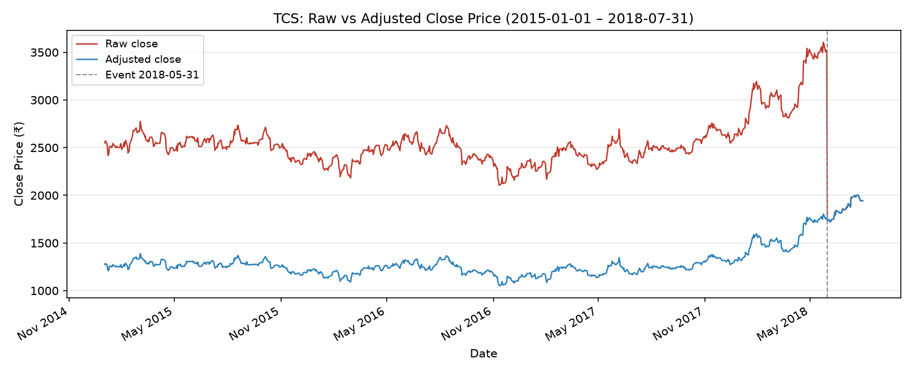
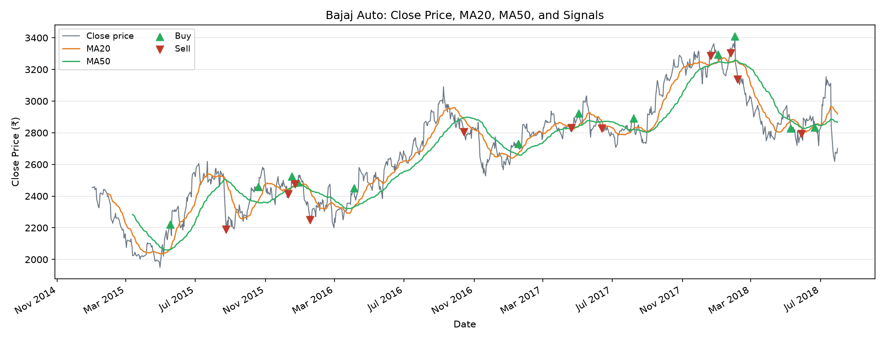

# NSE Stock Analysis: Insights Report

*Generated from `data/stocks.db` — 6 stocks, 2015-01-01 to 2018-07-31*

## 1. Summary

Five headline findings (each links to its section):

- **TVS Motors and Eicher Motors led the group** over the study period: adjusted close prices rose 86.9% and 82.6% respectively. The other four stocks returned far less or fell. → [Per-stock results](#4-per-stock-results)

- **Two price events require adjustment.** TCS on 2018-05-31 and Infosys on 2015-06-15 each show a close that roughly halved overnight with no sustained recovery, consistent with a 1:1 bonus issue. Dividing pre-event prices by 2 changes TCS's headline return from -23.8% to 52.4% and Infosys's from -30.9% to 38.2%. → [Price events](#3-two-price-events)

- **The golden-cross rule generated 54 round trips across all six stocks, of which 21 were profitable.** Eicher Motors was the only stock where every round trip made money (6 of 6). → [Per-stock results](#4-per-stock-results)

- **Whipsaw signals were common.** 34 consecutive signal pairs were 30 calendar days apart or fewer. Of the 11 round trips that also fell within that window, 10 lost money. → [Whipsaws](#5-whipsaws)

- **The simple moving-average rule has a structural lag.** The first crossover signal cannot arrive before 50 trading days of data have accumulated; the rule cannot warn of events that happened before that threshold. → [Method questions](#6-method-questions)

---
## 2. Data and Method

**Data.** Daily closing prices for six NSE stocks — Bajaj Auto, Eicher Motors, Hero Motocorp, Infosys, TCS, TVS Motors — sourced from CSV files covering 2015-01-01 to 2018-07-31 (889 trading days per stock). Only `close_price` is used. No dividends, intraday prices, or market-index data are included.

**Adjustment.** Two stocks show a roughly 50% overnight drop with no sustained recovery (see [Section 3](#3-two-price-events)). All analysis uses an adjusted series for those stocks: close prices *before* the event date are divided by 2. All other stocks use raw prices.

**Signal rule.** For each stock, compute:

- MA20 = 20-trading-day simple moving average of adjusted close price.
- MA50 = 50-trading-day simple moving average of adjusted close price.
- Both are set to NULL until a full window is available (row 20 and row 50 respectively).
- **Buy** signal: the day MA20 crosses *above* MA50 (i.e., `ma20 > ma50` and on the previous day `prev_ma20 <= prev_ma50`).
- **Sell** signal: the day MA20 crosses *below* MA50.
- All other days: Hold.

Averages use *unrounded* prices (same crossover dates result whether or not ROUND is applied to 2 d.p. — verified in `src/run_task10.py`).

> [!NOTE]
> **Round trips** are Buy–Sell pairs in consecutive signal order. The percentage return is `(sell_close − buy_close) / buy_close × 100`. Brokerage costs and dividends are excluded.

---
## 3. Two Price Events

### 3.1 TCS — Event Date 2018-05-31

**Claim.** TCS's closing price roughly halved from 2018-05-30 to 2018-05-31 with no subsequent recovery, consistent with a 1:1 bonus issue (adjustment factor 2).

**Evidence.** `sql/12_worst_day.sql` flags 2018-05-31 as TCS's single worst daily close change (−50.4%). The table below shows the 3 days before and 3 days after.

| Date | Raw Close (₹) | Adj Close (₹) |
|------|---------------|---------------|
| 2018-05-28 | 3503.80 | 1751.90 |
| 2018-05-29 | 3522.70 | 1761.35 |
| 2018-05-30 | 3517.75 | 1758.88 |
| 2018-05-31 | 1744.80 | 1744.80 ← event |
| 2018-06-01 | 1732.25 | 1732.25 |
| 2018-06-04 | 1744.55 | 1744.55 |
| 2018-06-05 | 1721.20 | 1721.20 |

**Caveat.** This analysis assumes a clean factor-2 adjustment. The event type (bonus issue vs. stock split vs. spin-off) should be confirmed from an external source before quoting adjusted figures.

### 3.2 Infosys — Event Date 2015-06-15

**Claim.** Infosys shows the same pattern on 2015-06-15 (−49.9% single-day close change per `sql/12_worst_day.sql`), also consistent with a 1:1 bonus issue.

**Evidence.** The 3-day window below confirms prices settled immediately into the new level:

| Date | Raw Close (₹) | Adj Close (₹) |
|------|---------------|---------------|
| 2015-06-10 | 2026.20 | 1013.10 |
| 2015-06-11 | 2001.85 | 1000.92 |
| 2015-06-12 | 1976.65 | 988.33 |
| 2015-06-15 | 991.10 | 991.10 ← event |
| 2015-06-16 | 999.45 | 999.45 |
| 2015-06-17 | 995.80 | 995.80 |
| 2015-06-18 | 1000.90 | 1000.90 |

**Caveat.** Same as Section 3.1.

### 3.3 What the Adjustment Changes

*The chart shows the discontinuity in the raw series and the continuous adjusted series.*

**Effect on percentage change:**

| Stock | Raw % change | Adjusted % change |
|-------|-------------|-------------------|
| TCS | -23.8 | 52.4 |
| Infosys | -30.9 | 38.2 |

**Effect on signals:**

| Stock | Version | Buys | Sells | Last signal |
|-------|---------|------|-------|-------------|
| TCS | Raw | 12 | 13 | Sell 2018-06-05 |
| TCS | Adjusted | 12 | 12 | Buy 2018-04-20 |
| Infosys | Raw | 9 | 9 | Buy (same date) |
| Infosys | Adjusted | 10 | 10 | Buy 2018-05-07 |

**Dates where signals differ (from `sql/15_adjusted_signals_all.sql`):**

| Stock | Date | Raw signal | Adjusted signal |
|-------|------|-----------|----------------|
| Infosys | 2015-07-01 | Hold | Buy |
| Infosys | 2015-07-08 | Hold | Sell |
| Infosys | 2015-07-27 | Hold | Buy |
| Infosys | 2015-08-18 | Buy | Hold |
| TCS | 2018-06-05 | Sell | Hold |

The adjustment eliminates the artificial MA50 distortion caused by the halving event remaining in the window for 50 trading days. For TCS, the raw series produces an extra Sell on 2018-06-05 that the adjusted series suppresses. For Infosys, the adjusted series detects three additional signal flips in July–August 2015 that are also an artefact of the discontinuity passing through the window.

---
## 4. Per-Stock Results

### 4.1 Summary Table

Prices and signals use the adjusted series. % change is from first to last trading day (`sql/11_pct_change.sql`). Signals from `sql/10_all_stocks.sql`. Round trips from `sql/16_whipsaws.sql`.

| Stock | First close | Last close | % change | Buys | Sells | Last signal | Last date | Round trips | Winners | Avg RT return |
|-------|------------|-----------|---------|------|-------|-------------|-----------|------------|---------|--------------|
| TVS Motors | 276.85 | 517.45 | 86.9% | 8 | 8 | Sell | 2018-05-17 | 8 | 3 | 11.2% |
| Eicher Motors | 15239.15 | 27820.95 | 82.6% | 6 | 7 | Sell | 2018-06-06 | 6 | 6 | 10.1% |
| TCS | 1274.10 | 1941.25 | 52.4% | 12 | 12 | Buy | 2018-04-20 | 11 | 2 | -3.4% |
| Infosys | 987.90 | 1365.00 | 38.2% | 10 | 10 | Buy | 2018-05-07 | 9 | 3 | -0.4% |
| Bajaj Auto | 2454.10 | 2700.70 | 10.0% | 12 | 11 | Buy | 2018-06-21 | 11 | 4 | 0.4% |
| Hero Motocorp | 3107.30 | 3293.80 | 6.0% | 9 | 9 | Sell | 2018-05-22 | 9 | 3 | -1.7% |

### 4.2 Stock-by-Stock Notes

#### TVS Motors

**Claim.** Close price rose 86.9% over the full period, the largest gain in the group.

**Evidence.** One round trip (2017-01-06 to 2018-01-29) returned 86.7% and dominates the average. The other 7 trips averaged 0.4% combined.

**Caveat.** A single long-held trade can distort the average; the sample of 8 trips is small. The signal method uses only MA crossovers and cannot reflect fundamentals.

#### Eicher Motors

**Claim.** Close price rose 82.6% and every one of the 6 Buy–Sell round trips was profitable.

**Evidence.** sql/11_pct_change.sql and sql/16_whipsaws.sql; 6 round trips, 6 winners.

**Caveat.** 6 round trips is a small sample; a longer period could show losses. The trend is strong, but the rule cannot detect peaks in advance.

#### TCS

**Claim.** Adjusted close rose 52.4%. Raw close would show -23.8%, a misleading decline caused by the bonus event. The adjusted series' last signal is a Buy on 2018-04-20, whereas the raw series ends on a Sell on 2018-06-05. The adjusted version is more consistent with the positive long-run trend; the raw-series Sell is an artefact of the un-adjusted event passing through the MA50 window.

**Evidence.** sql/13_adjusted.sql; sql/15_adjusted_signals_all.sql.

**Caveat.** Same adjustment caveat as Infosys.

#### Infosys

**Claim.** Adjusted close rose 38.2%. Raw close would show -30.9%, a misleading decline caused by the bonus event.

**Evidence.** sql/13_adjusted.sql (adjusted % change); sql/15_adjusted_signals_all.sql (signal differences).

**Caveat.** The adjustment factor of 2 is assumed, not verified. The adjusted signal count (10/10) differs from the raw count (9/9) on four dates.

#### Bajaj Auto

**Claim.** Price rose 10.0% overall, but the rule's 11 round trips returned only 0.4% on average with 4 of 11 profitable, largely because of frequent whipsaws in late 2015.

**Evidence.** sql/10_all_stocks.sql (signals), sql/16_whipsaws.sql (round trips).

**Caveat.** The whipsaw period in late 2015 is short and may not recur; average return is not compounded.

#### Hero Motocorp

**Claim.** Price rose 6.0% overall. The signal rule produced 9 round trips with only 3 winners and an average of -1.7%.

**Evidence.** sql/10_all_stocks.sql; sql/16_whipsaws.sql.

**Caveat.** Small sample; average return is not compounded.

---
## 5. Whipsaws

*Green triangles = Buy signals; red triangles = Sell signals.*

Across all six stocks, 34 consecutive signal pairs were 30 calendar days apart or fewer. 11 of these also formed round trips (Buy → Sell within 30 days); 10 of those 11 lost money.

**Short-gap pairs per stock:**

| Stock | Consecutive signal pairs ≤ 30 days | Round trips ≤ 30 days | Avg return of those trips |
|-------|-----------------------------------|-----------------------|---------------------------|
| TVS Motors | 4 | 2 | -8.3% |
| Eicher Motors | 1 | 0 | —% |
| TCS | 8 | 1 | -4.4% |
| Infosys | 6 | 2 | -3.3% |
| Bajaj Auto | 11 | 5 | -4.1% |
| Hero Motocorp | 4 | 1 | -6.5% |

### 5.1 Illustrative Whipsaw Examples

**Bajaj Auto, December 2015.** Four signals in 17 calendar days:

| Date | Signal | Close (₹) | Round-trip return |
|------|--------|----------|------------------|
| 2015-12-11 | Sell | 2411.90 | -1.9% (this sell) |
| 2015-12-17 | Buy | 2524.20 | -1.9% |
| 2015-12-23 | Sell | 2475.60 | -1.9% (this sell) |
| 2015-12-28 | Buy | 2487.45 | -9.6% |

**Bajaj Auto, Feb 2018.** Buy on 2018-02-01 at ₹3,409.50, Sell on 2018-02-06 at ₹3,138.20 (5 calendar days, −8.0% return). This single trade cost more than the full-period price gain of 10.0%.

**TCS, Oct 2015.** Buy on 2015-10-13, Sell on 2015-10-14 — a 1-calendar-day round trip returning −4.4%. The signal crossed back in the first trading session.

**Five shortest-gap signal pairs across all stocks:**

| Stock | Prev date | Prev signal | Prev close | Date | Signal | Close | Gap (days) |
|-------|-----------|------------|-----------|------|--------|-------|-----------|
| TCS | 2015-10-13 | Buy | 1298.70 | 2015-10-14 | Sell | 1241.70 | 1 |
| Infosys | 2015-09-28 | Sell | 1108.20 | 2015-10-01 | Buy | 1173.25 | 3 |
| TCS | 2017-02-09 | Sell | 1162.13 | 2017-02-13 | Buy | 1205.15 | 4 |
| Bajaj Auto | 2015-12-23 | Sell | 2475.60 | 2015-12-28 | Buy | 2487.45 | 5 |
| Bajaj Auto | 2018-02-01 | Buy | 3409.50 | 2018-02-06 | Sell | 3138.20 | 5 |

---
## 6. Method Questions

### 6.a Lag of the golden-cross rule

A simple moving average uses only past closing prices. MA20 on day *d* averages days *d−19* to *d*; MA50 averages *d−49* to *d*. The first day MA50 can have a value is trading-day 50 (the 50th row in the dataset). A crossover signal additionally requires the *previous* day's MA50, so the earliest possible signal date is **trading-day 51**. In this dataset that corresponds to 2015-03-13 for the MA50 warm-up; Bajaj Auto's first Buy is **2015-05-18**, 98 days after the start of data.

Implication: the rule cannot react to any trend that began before row 51, and it always reflects where the price *was* rather than where it is going. A sharp reversal will take many days before the crossover fires.

### 6.b What changes after adjustment

Before adjustment, TCS and Infosys appear to have **lost** money over the period (-23.8% and -30.9%). After adjusting, both **gained** (52.4% and 38.2%). The direction of the result reverses — a material difference.

Signal counts change for both stocks (see [Section 3.3](#33-what-the-adjustment-changes)). For TCS, the last signal changes from a Sell (raw) to a Buy (adjusted). Treating the adjusted series as more representative of the true economic return, the raw Sell is an artefact of the price discontinuity still sitting inside the MA50 window.

### 6.c What this data lacks

| Missing element | Why it matters |
|----------------|---------------|
| **Dividends** | The total return is higher than the price return alone; |
|               | this analysis understates actual long-run gains. |
| **Brokerage costs** | Each round trip incurs transaction costs; |
|               | the thin margins on short-gap trades may not survive costs. |
| **Market index** | Without a benchmark (e.g., Nifty 50), it is impossible to |
|               | judge whether the rule adds value over passive investing. |
| **News and fundamentals** | Price-only rules cannot distinguish a correction from |
|               | a structural decline. |

---
## 7. Limits of This Analysis

- **Small samples.** Each stock has between 6 and 11 round trips. Averages over such small samples are unreliable; a single unusual trade (as with TVS Motors) can dominate the result.

- **Simple averages vs. buy-and-hold.** The average round-trip return is an arithmetic mean of per-trade returns. It is not compounded and cannot be compared directly with the first-to-last percentage change in the summary table.

- **TVS Motors outlier.** One round trip (2017-01-06 to 2018-01-29) returned 86.7%. The remaining 7 TVS trips averaged 0.4%. Conclusions about TVS strategy performance rest almost entirely on one trade.

- **No out-of-sample test.** The signals were computed on the same data used to describe them; there is no forward test. Results may not repeat in a different period.

---
*Report generated by `src/make_report.py` from `data/stocks.db`. No numbers were entered by hand.*
